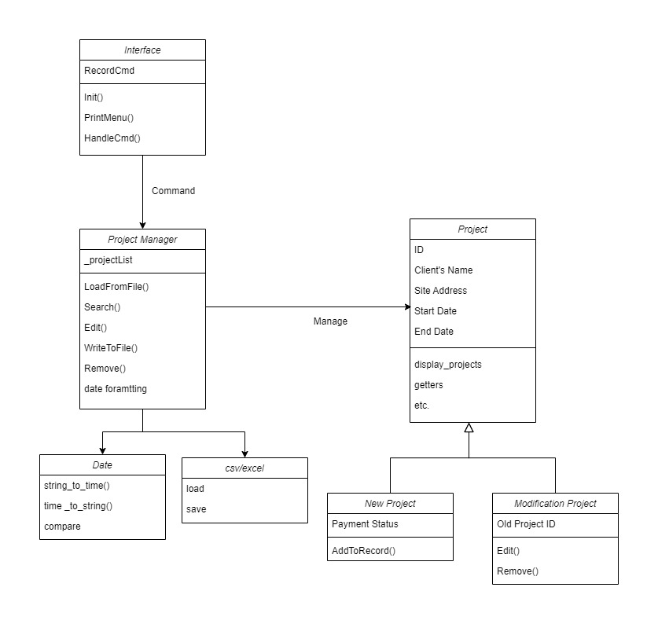

# Project-Record-Database-Management with C++

The pathway of my previous work is sequentially as briefly described in the diagram below. It is obervious that:
    - The complexity is exploding and
    - The flexibility is limited if I 'd like to add more functions,
    - The Product Time (Responding time) gets longer when Database gets larger.
    
As a result, I decided to try OOP programing so it can handle the large database in this case. The draft concept of classes and constructors is shown below. Codes can be found in OOP directory.

SQL server 

The idea of Database, attributes, and tuples comes from my work at FPS Corp Inc., however all values or contents have been changed or disordered for data security, and will not be used for any other purpose.
